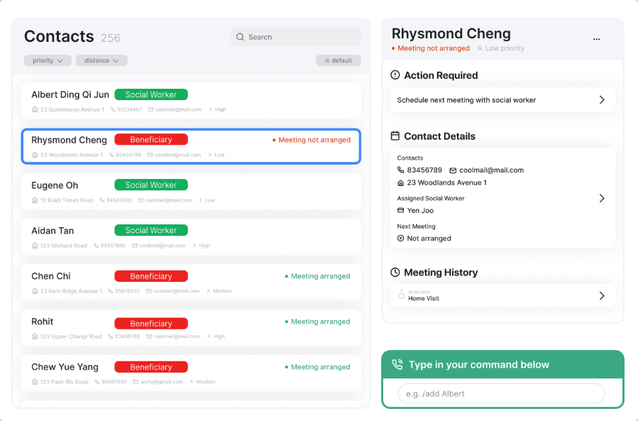

# CareLink
## Project Overview
- This is **an application for NGOs to keep records of their beneficiaries and social workers**.

## Features
  - add the contact of a beneficiary or social worker
  - retrieve a contact
  - update a contact 
  - delete a contact

## Credits
- This project is based on the AddressBook-Level3 project created by the [SE-EDU initiative](https://se-education.org)
  - It is **written in OOP fashion**. It provides a **reasonably well-written** code base **bigger** (around 6 KLoC) than what students usually write in beginner-level SE modules, without being overwhelmingly big.
  - It comes with a **reasonable level of user and developer documentation**.
- It is named `AddressBook Level 3` (`AB3` for short) because it was initially created as a part of a series of `AddressBook` projects (`Level 1`, `Level 2`, `Level 3` ...).
- For the detailed documentation of this project, see the **[Address Book Product Website](https://se-education.org/addressbook-level3)**.
